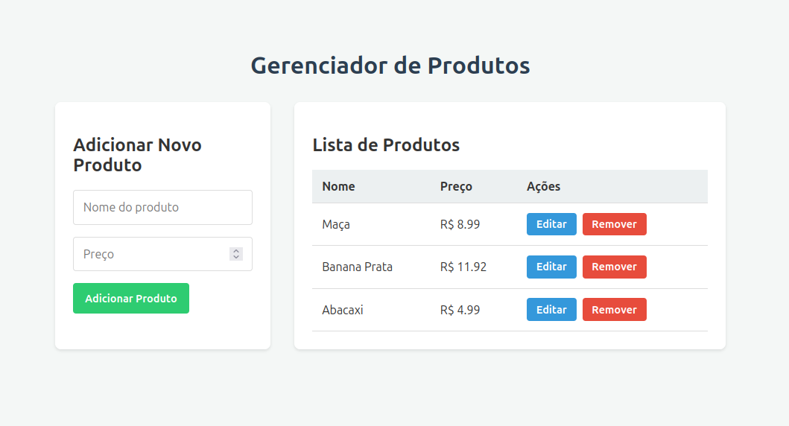

# Projeto CRUD Full Stack com Java Spring Boot e React

Uma aplicação web Full Stack simples que demonstra as operações de CRUD (Create, Read, Update, Delete) para gerenciar uma lista de produtos.

Este projeto foi desenvolvido como um exemplo prático de como integrar um backend robusto construído com Java e Spring Boot com um frontend moderno e interativo construído com React.

## Screenshot da Aplicação



## Funcionalidades

* **Criar:** Adicionar novos produtos através de um formulário.
* **Ler:** Visualizar a lista completa de produtos cadastrados.
* **Atualizar:** Editar as informações de um produto existente.
* **Deletar:** Remover um produto da lista.

## Tecnologias Utilizadas

#### **Backend**
* **Java 17+**
* **Spring Boot 3**
* **Spring Data JPA / Hibernate:** Para persistência de dados.
* **Maven:** Para gerenciamento de dependências e build do projeto.
* **H2 Database:** Banco de dados em memória para ambiente de desenvolvimento.

#### **Frontend**
* **React**
* **JavaScript (ES6+)**
* **HTML5 & CSS3**
* **Node.js & npm:** Para o ambiente de desenvolvimento do frontend.

## Pré-requisitos

Antes de começar, você vai precisar ter instalado em sua máquina:
* [Java JDK](https://www.oracle.com/java/technologies/downloads/) (versão 17 ou superior)
* [Apache Maven](https://maven.apache.org/download.cgi)
* [Node.js e npm](https://nodejs.org/en/)
* [Git](https://git-scm.com/)

## Como Rodar o Projeto

Siga os passos abaixo para configurar e executar a aplicação em seu ambiente local.

### 1. Clone o Repositório

```bash
git clone [https://github.com/verasalan/projeto-crudsimples-fullstack.git](https://github.com/verasalan/projeto-crudsimples-fullstack.git)
cd projeto-crudsimples-fullstack
```

### 2. Executando o Backend (A Cozinha)

Abra um terminal e siga os passos:

```bash
# Navegue até a pasta do backend
cd backend/crud-simples/

# Use o Maven para compilar e rodar a aplicação Spring Boot
mvn spring-boot:run
```
O servidor do backend iniciará na porta `8080`. Você verá uma mensagem no console indicando `Tomcat started on port(s): 8080`.

### 3. Executando o Frontend (O Salão)

**Abra um novo terminal** (mantenha o terminal do backend rodando!) e siga os passos:

```bash
# Navegue até a pasta do frontend
cd frontend/crud-frontend/

# Instale as dependências do projeto (só precisa fazer isso na primeira vez)
npm install

# Inicie o servidor de desenvolvimento do React
npm start
```
A aplicação frontend abrirá automaticamente em seu navegador no endereço `http://localhost:3000`.

## Documentação da API

O backend expõe os seguintes endpoints REST para o gerenciamento de produtos:

| Verbo HTTP | Endpoint                 | Descrição                            |
| :--------- | :----------------------- | :----------------------------------- |
| `GET`      | `/api/produtos`          | Retorna a lista de todos os produtos.|
| `GET`      | `/api/produtos/{id}`     | Retorna um produto específico.       |
| `POST`     | `/api/produtos`          | Cria um novo produto.                |
| `PUT`      | `/api/produtos/{id}`     | Atualiza um produto existente.       |
| `DELETE`   | `/api/produtos/{id}`     | Deleta um produto.                   |


